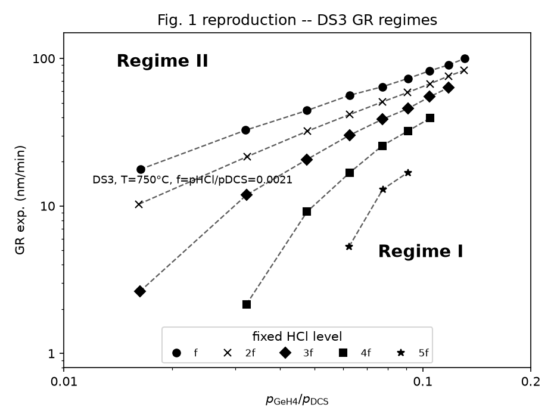
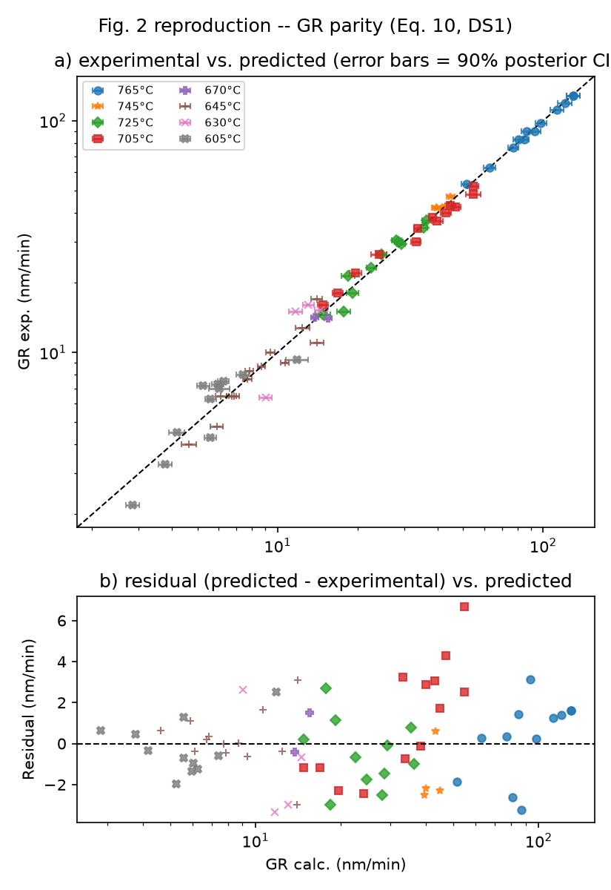
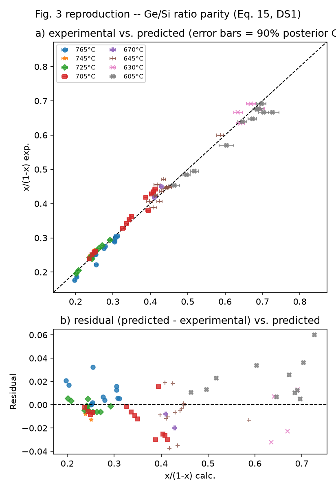
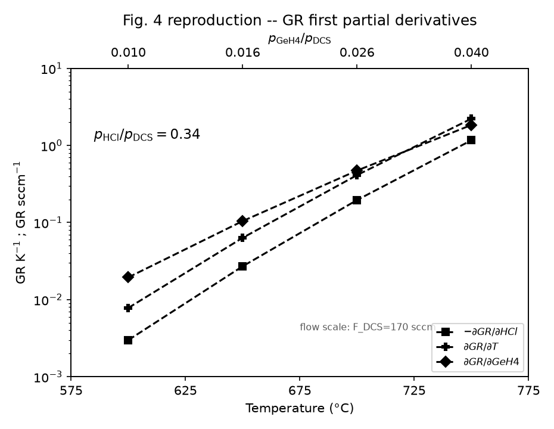
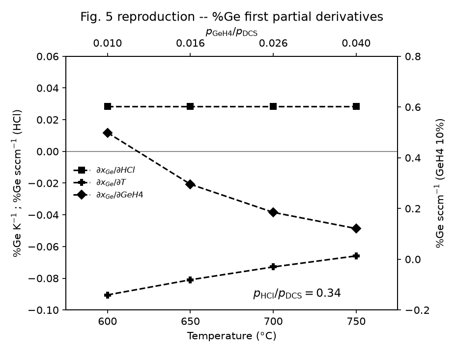
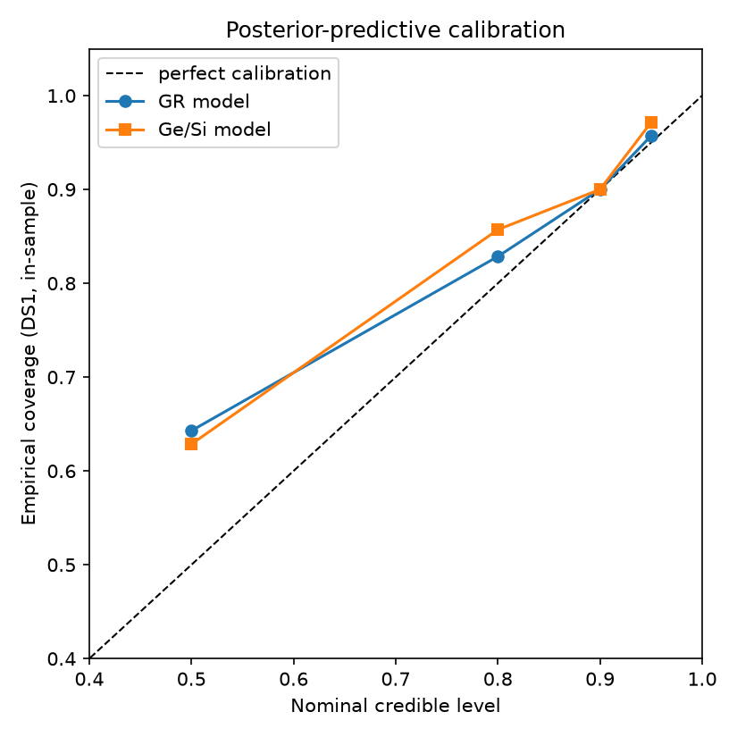

# Tomasini et al. (2010) Reproduction: Validation Report

Generated 2026-07-08T11:13:07 on Python 3.11.15.

Source: P. Tomasini, V. Machkaoutsan, S.G. Thomas, "Analysis of silicon germanium vapor phase epitaxy kinetics," *Thin Solid Films* 518 (2010) S12-S17.

Dataset: 152 canonical rows ingested from the paper's appendices (DS1=70, DS2_GR=18, DS2_B=11, DS3=35, DS4=18).

## Figures

Calibration (empirical coverage vs. nominal credible level, DS1 in-sample): GR model = ['0.64', '0.83', '0.90', '0.96'] at levels [0.5, 0.8, 0.9, 0.95]; Ge/Si model = ['0.63', '0.86', '0.90', '0.97']. Both models sit slightly *above* the diagonal (conservative, not overconfident) and are within ~0.02 of nominal by the 90% level.

## Phase 4 -- Bayesian calibration on DS1/DS2 (the core reproduction)

| Metric | This pipeline | Paper | Target |
|---|---|---|---|
| DS1 GR parity R² | 0.996 | 0.985 (Eq. 10) | ≥ 0.98 |
| DS1 Ge% parity R² | 0.987 | 0.988 (Eq. 15) | ≥ 0.98 |
| κ_GR (= paper's Ea/R) | -24483 K | -24,507 K | within ±10% |
| γ_HCl | -0.710 | -0.7 | ±0.1 |
| γ_GeH4 | 1.310 | 1.3 | ±0.15 |
| DS2 [B] parity R² | 0.994 | -- (Eq. 20) | -- |
| β_B2H6 | 0.780 | ~0.8 (Eq. 20) | ±0.2 |
| **Overall PASS** | **True** | | |

Note: `kappa_Ge`'s sign was corrected during implementation (paper's tabulated "ΔEa/R = -4319" does not transfer directly to this parametrization -- see `chem_ml/physics_core.py` docstring). Verified directly against DS1: at matched GeH4/DCS≈0.045, Ge% is ~33% at 605 C vs ~21% at 765 C.

## Phase 6 -- Sensitivity analysis (reproduces Fig. 4)

Operating points from Fig. 4's own caption: pHCl/pDCS=0.34 fixed, pGeH4/pDCS solved per-T to hit 20% Ge. These exact points were not part of the Phase 4 fit target, so recovering them is an independent check.

| T (C) | GR (this pipeline, nm/min) | GR (paper, nm/min) |
|---|---|---|
| 600 | 0.243 | 0.370 |
| 650 | 2.205 | 2.500 |
| 700 | 15.943 | 15.000 |
| 750 | 95.003 | 73.000 |

dGR/dT at 750 C: **2.222 nm/min/K** (paper: 1-2 nm/min/K range) -- within range.

Posterior eigenspectrum (GR model, 4 params): stiffest = `lnK_GR`, sloppiest = `gamma_GeH4` (eigenvalue ratio 1267x).

## Phase 7 -- Cross-reactor validation (DS3 Hartmann, DS4 Tan)

theta_chem frozen at its Phase 4 DS1 posterior mean; only a 3-4 parameter delta_r fit per reactor (no chemistry refit).

| Dataset | Observable | This pipeline R² | Paper R² | delta_r params |
|---|---|---|---|---|
| DS3 (Hartmann) | GR | 0.839 | 0.844 (Eq. 11) | 4 |
| DS3 (Hartmann) | Ge/Si | 0.960 | 0.994 (Eq. 16) | 4 |
| DS4 (Tan) | Ge/Si | 0.888 | ~0.970 (Eqs. 18-19, blended) | 3 |
| **Overall PASS** | | **True** | | |

DS3's own paper GR R² (0.844) is already well below DS1's (0.985) -- that's the dataset Fig. 1's Regime-I curvature comes from, so matching it (not beating it) is the correct reproduction. DS4's Ge/Si gap vs. the paper is a documented consequence of theta_ge being frozen boron-free from DS1, applied to DS4 which has a trace-B2H6 term the paper's own DS4-specific model includes and this one deliberately doesn't (see `chem_ml/reactor_transfer.py` docstring).

## Phase 8 -- Inverse design (spot check)

| Target | Achieved GR | Achieved Ge | Confidence |
|---|---|---|---|
| GR=29.3 nm/min, Ge=21.7% (matches DS1 run #70) | 29.288 nm/min (0.042% err) | 21.754% | ACCEPTED |
| GR=500 nm/min, Ge=60% (outside DS1's range) | 396.256 nm/min (20.749% err) | 27.502% | REFUSED |

## Known data gaps (documented, not silently worked around)

- **DS4 has no growth time** in Tomasini's Appendix III, so GR cannot be computed for DS4 (only Thickness/Ge% are usable) -- DS4 is Ge/Si-only throughout this pipeline.
- **DS1 stores pressure ratios, not raw MFC flows**, so the Fig. 4/5 plotting code uses one explicit effective DCS-flow conversion to place pressure-ratio derivatives on Tomasini's sccm axes. The raw ratio-space derivatives remain the model-native quantities.

## Summary: ALL GATES PASS
